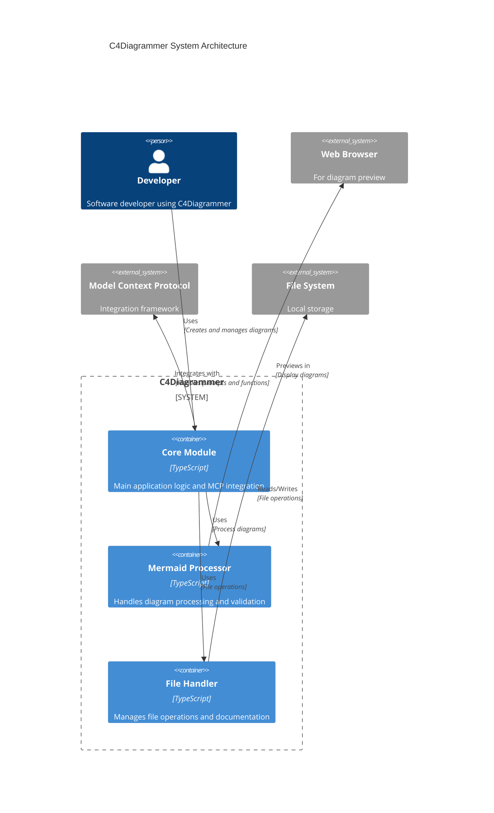

```mermaid
C4Container
title C4Diagrammer System Architecture

Person(developer, "Developer", "Software developer using C4Diagrammer")

System_Boundary(c4diagrammer, "C4Diagrammer") {
    Container(core, "Core Module", "TypeScript", "Main application logic and MCP integration")
    Container(mermaid_processor, "Mermaid Processor", "TypeScript", "Handles diagram processing and validation")
    Container(file_handler, "File Handler", "TypeScript", "Manages file operations and documentation")
}

System_Ext(browser, "Web Browser", "For diagram preview")
System_Ext(mcp, "Model Context Protocol", "Integration framework")
System_Ext(filesystem, "File System", "Local storage")

Rel(developer, core, "Uses", "Creates and manages diagrams")
Rel(core, mcp, "Integrates with", "Handles prompts and functions")
Rel(core, mermaid_processor, "Uses", "Process diagrams")
Rel(core, file_handler, "Uses", "File operations")
Rel(mermaid_processor, browser, "Previews in", "Display diagrams")
Rel(file_handler, filesystem, "Reads/Writes", "File operations")
``` 