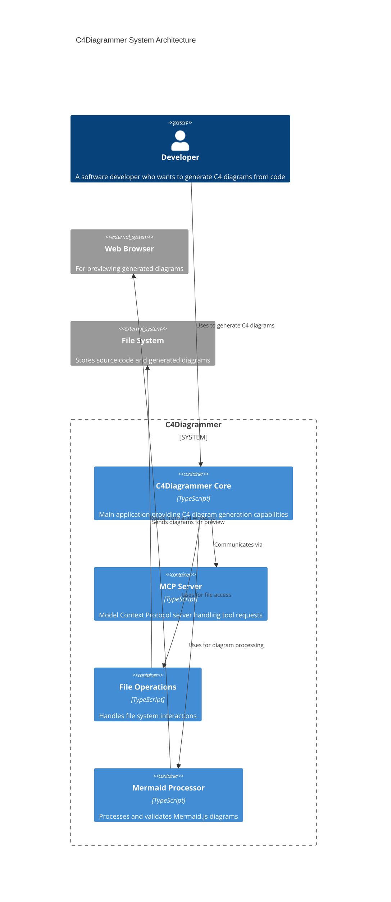

# C4Diagrammer System Architecture

This C4 Container diagram shows the architecture of the C4Diagrammer system, which is designed to generate C4 architecture diagrams from code. The main components include:

- **C4Diagrammer Core**: The main application providing C4 diagram generation capabilities
- **MCP Server**: Model Context Protocol server handling tool requests
- **File Operations**: Module that handles file system interactions
- **Mermaid Processor**: Component that processes and validates Mermaid.js diagrams

The system interacts with external systems:
- Web Browser: Used for previewing generated diagrams
- File System: Stores source code and generated diagrams

The diagram illustrates the relationships between these components, showing how they collaborate to provide diagram generation functionality to developers.