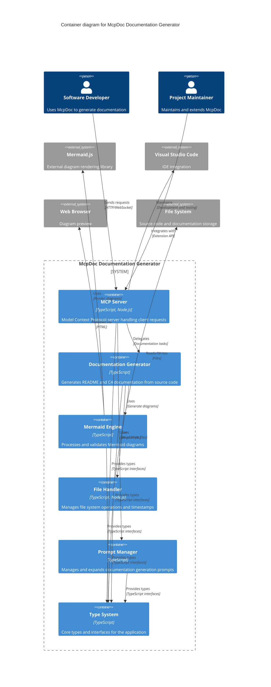

```mermaid
C4Container
    title Container diagram for McpDoc Documentation Generator
    
    Person(developer, "Software Developer", "Uses McpDoc to generate documentation")
    Person(maintainer, "Project Maintainer", "Maintains and extends McpDoc")
    
    System_Boundary(mcpdoc, "McpDoc Documentation Generator") {
        Container(mcp_server, "MCP Server", "TypeScript, Node.js", "Model Context Protocol server handling client requests")
        Container(doc_generator, "Documentation Generator", "TypeScript", "Generates README and C4 documentation from source code")
        Container(mermaid_engine, "Mermaid Engine", "TypeScript", "Processes and validates Mermaid diagrams")
        Container(file_handler, "File Handler", "TypeScript, Node.js", "Manages file system operations and timestamps")
        Container(prompt_manager, "Prompt Manager", "TypeScript", "Manages and expands documentation generation prompts")
        Container(type_system, "Type System", "TypeScript", "Core types and interfaces for the application")
    }
    
    System_Ext(mermaidjs, "Mermaid.js", "External diagram rendering library")
    System_Ext(vscode, "Visual Studio Code", "IDE integration")
    System_Ext(browser, "Web Browser", "Diagram preview")
    System_Ext(filesystem, "File System", "Source code and documentation storage")
    
    Rel(developer, mcp_server, "Sends requests", "HTTP/WebSocket")
    Rel(maintainer, mcp_server, "Maintains", "Development and testing")
    
    Rel(mcp_server, doc_generator, "Delegates", "Documentation tasks")
    Rel(mcp_server, prompt_manager, "Uses", "Get prompts")
    Rel(doc_generator, mermaid_engine, "Uses", "Generate diagrams")
    Rel(doc_generator, file_handler, "Uses", "Read/Write files")
    Rel(mermaid_engine, mermaidjs, "Uses", "Render diagrams")
    Rel(file_handler, filesystem, "Reads/Writes", "Files")
    Rel(mermaid_engine, browser, "Previews via", "HTML")
    Rel(mcp_server, vscode, "Integrates with", "Extension API")
    
    Rel_Back(type_system, mcp_server, "Provides types", "TypeScript interfaces")
    Rel_Back(type_system, doc_generator, "Provides types", "TypeScript interfaces")
    Rel_Back(type_system, mermaid_engine, "Provides types", "TypeScript interfaces")
    Rel_Back(type_system, file_handler, "Provides types", "TypeScript interfaces")
    Rel_Back(type_system, prompt_manager, "Provides types", "TypeScript interfaces")
```