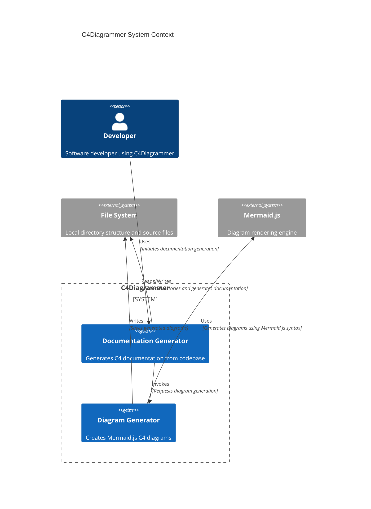

```mermaid
C4Context
    title C4Diagrammer System Context

    Person(developer, "Developer", "Software developer using C4Diagrammer")
    
    System_Boundary(c4diagrammer, "C4Diagrammer") {
        System(docGenerator, "Documentation Generator", "Generates C4 documentation from codebase")
        System(diagramGenerator, "Diagram Generator", "Creates Mermaid.js C4 diagrams")
    }
    
    System_Ext(filesystem, "File System", "Local directory structure and source files")
    System_Ext(mermaidjs, "Mermaid.js", "Diagram rendering engine")
    
    Rel(developer, docGenerator, "Uses", "Initiates documentation generation")
    Rel(docGenerator, filesystem, "Reads/Writes", "Scans directories and generates documentation")
    Rel(docGenerator, diagramGenerator, "Invokes", "Requests diagram generation")
    Rel(diagramGenerator, mermaidjs, "Uses", "Generates diagrams using Mermaid.js syntax")
    Rel(diagramGenerator, filesystem, "Writes", "Saves generated diagrams")
``` 