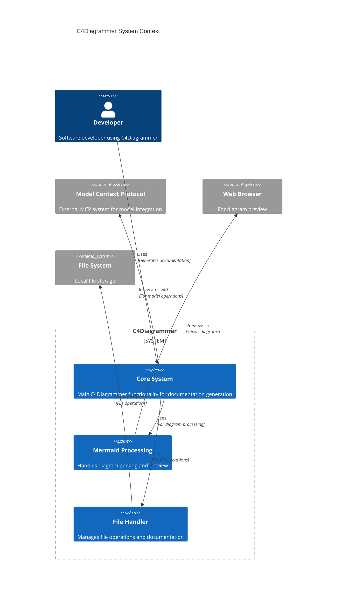

```mermaid
C4Context
title C4Diagrammer System Context

Person(developer, "Developer", "Software developer using C4Diagrammer")

System_Boundary(c4diagrammer, "C4Diagrammer") {
    System(core, "Core System", "Main C4Diagrammer functionality for documentation generation")
    System(mermaid, "Mermaid Processing", "Handles diagram parsing and preview")
    System(file_handler, "File Handler", "Manages file operations and documentation")
}

System_Ext(mcp, "Model Context Protocol", "External MCP system for model integration")
System_Ext(browser, "Web Browser", "For diagram preview")
System_Ext(filesystem, "File System", "Local file storage")

Rel(developer, core, "Uses", "Generates documentation")
Rel(core, mcp, "Integrates with", "For model operations")
Rel(core, mermaid, "Uses", "For diagram processing")
Rel(core, file_handler, "Uses", "For file operations")
Rel(mermaid, browser, "Previews in", "Shows diagrams")
Rel(file_handler, filesystem, "Reads/Writes", "File operations")
``` 