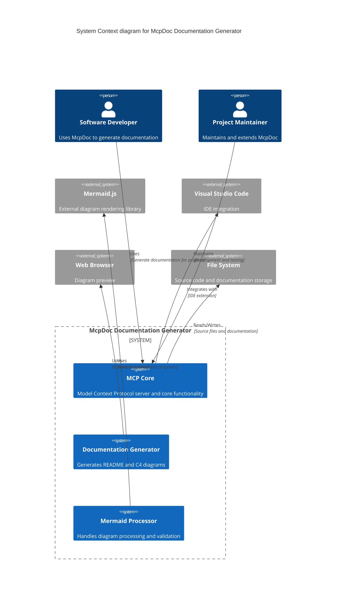

```mermaid
C4Context
    title System Context diagram for McpDoc Documentation Generator
    
    Person(developer, "Software Developer", "Uses McpDoc to generate documentation")
    Person(maintainer, "Project Maintainer", "Maintains and extends McpDoc")
    
    System_Boundary(mcpdoc, "McpDoc Documentation Generator") {
        System(core, "MCP Core", "Model Context Protocol server and core functionality")
        System(docgen, "Documentation Generator", "Generates README and C4 diagrams")
        System(mermaid_processor, "Mermaid Processor", "Handles diagram processing and validation")
    }
    
    System_Ext(mermaidjs, "Mermaid.js", "External diagram rendering library")
    System_Ext(vscode, "Visual Studio Code", "IDE integration")
    System_Ext(browser, "Web Browser", "Diagram preview")
    System_Ext(filesystem, "File System", "Source code and documentation storage")
    
    Rel(developer, core, "Uses", "Generate documentation for projects")
    Rel(maintainer, core, "Maintains", "Development and testing")
    
    Rel(mermaid_processor, mermaidjs, "Uses", "Render and validate diagrams")
    Rel(core, vscode, "Integrates with", "IDE extension")
    Rel(docgen, browser, "Uses", "Preview diagrams")
    Rel(core, filesystem, "Reads/Writes", "Source files and documentation")
```