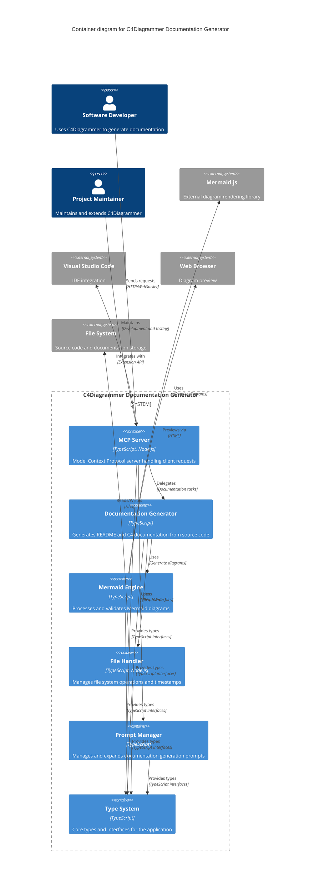

# C4Diagrammer

C4Diagrammer is a Model Context Protocol (MCP) server implementation designed to generate documentation for existing systems. It provides a set of MCP prompts and tools for generating code summaries and C4 architecture diagrams using Mermaid.js.

[Learn more about MCP](https://www.anthropic.com/news/model-context-protocol).
[Learn more about C4](https://c4model.com/).

The prompts direct the model to walk the directory tree of a system, creating summary documentation as it goes, and then rolling this up to the top level.

1. **For each directory containing 'source code' (you can decide what this is by tailoring the prompt), generate a README.C4Diagrammer.md file.** The concept is that any repo in need of automatic documentation generation is likely too large to fit in the context window, so you need to 'pre-store' summaries with a denser level of information than the source. The prompts direct the model to check file timestamps so we only re-generate summaries when we need to.

2. **Alongside each README.C4Diagrammer.md, we generate a C4Component diagram** to show the structure of the source modules in the directory.

3. **Finally, we roll up all the README.C4Diagrammer.md files into a C4Context and a C4Container diagram in the root directory** to serve as an overview. In principle, you can then navigate all the way from overview diagrams in the root directory through intermediate diagrams in each sub-directory containing source code.

We use the C4 model, as it aims to align with modern Agile practices by providing "just enough" documentation. The C4 approach emphasizes lightweight, living documentation that evolves alongside the codebase, avoiding the common problem of documentation becoming outdated or irrelevant over time ("documentation rot"). By focusing on essential architectural views at different levels of detail, C4 helps teams maintain useful documentation without creating burdensome maintenance overhead that often plagues more traditional documentation approaches.

The idea is aimed at the widely acknowledged problem of legacy codebases being complex and time-consuming to onboard new developers, developers having a hard time working out where to make changes, and people outside of the team having no clue what's going on. If you can auto-generate documentation that runs from the top to the bottom of your system, you have a much better chance of onboarding people quickly and helping everyone navigate around the system.

Going forward, you run the tools from within your IDE, check and tune the output, and then bingo you have done your job of providing a fighting chance for those who come after you.


## C4 Diagram Architecture

The C4 model is a hierarchical approach to software architecture documentation, consisting of four levels of diagrams:

1. **Context Diagrams** - The highest level view showing how your software system interacts with users and other systems. This diagram helps stakeholders and non-technical audiences understand the big picture.

2. **Container Diagrams** - Zooms in to show the high-level technical building blocks of your software system. Containers represent applications, data stores, microservices etc. that work together to deliver functionality.

3. **Component Diagrams** - A detailed view inside individual containers showing the key logical components and their interactions. This helps developers understand how the container is structured internally.

4. **Deployment Diagrams** - Shows how your software system is deployed across infrastructure. This includes details about technologies, hardware, and deployment environments.

Each level progressively adds more detail while following consistent notation. The C4 approach helps maintain clarity by showing the right level of detail for different audiences - from high-level stakeholders to developers working on specific components.

[Learn more about C4](https://c4model.com/).


## Example
Here is an example from running the prompts over the MCP Typescript SDK:

```mermaid
C4Context
    title Model Context Protocol (MCP) System Architecture

    Person(developer, "Developer", "Uses MCP tools and services")
    Person(end_user, "End User", "Interacts with applications built using MCP")

    System_Boundary(mcp, "Model Context Protocol (MCP)") {

        System(sdk, "MCP SDK", "Development kit for building applications using MCP")
        System(everything, "Everything Server", "Comprehensive server with various MCP features")
        
        System_Boundary(data_storage, "Data Storage") {
            System(filesystem, "Filesystem Server", "File operations with security measures")
            System(memory, "Memory Server", "Knowledge Graph-based memory system")
            System(postgres, "PostgreSQL Server", "Database access and querying")
            System(redis, "Redis Server", "Key-value store operations")
            System(sqlite, "SQLite Server", "Database operations and business insights")
        }
        
        System_Boundary(external_integrations, "External Service Integrations") {
            System(aws_kb, "AWS KB Retrieval", "AWS Bedrock Knowledge Base retrieval")
            System(brave_search, "Brave Search", "Web and local search capabilities")
            System(everart, "EverArt", "AI image generation")
            System(gdrive, "Google Drive", "Google Drive file access")
            System(github, "GitHub", "Repository and issue management")
            System(gitlab, "GitLab", "Project and merge request management")
            System(google_maps, "Google Maps", "Location-based services")
            System(puppeteer, "Puppeteer", "Browser automation")
            System(sentry, "Sentry", "Error tracking and analysis")
            System(slack, "Slack", "Workspace communication")
            System(time, "Time", "Timezone operations and conversions")
        }
        
        System(sequential_thinking, "Sequential Thinking", "Structured problem-solving framework")
    }

    System_Ext(aws_system, "AWS Bedrock", "AI models and knowledge base")
    System_Ext(brave_system, "Brave Search API", "Web search engine")
    System_Ext(everart_system, "EverArt API", "Image generation service")
    System_Ext(gdrive_system, "Google Drive API", "Cloud storage service")
    System_Ext(github_system, "GitHub API", "Code repository hosting")
    System_Ext(gitlab_system, "GitLab API", "Code repository hosting")
    System_Ext(gmaps_system, "Google Maps API", "Mapping and location services")
    System_Ext(sentry_system, "Sentry API", "Error tracking platform")
    System_Ext(slack_system, "Slack API", "Team communication platform")
      
    Rel(developer, sdk, "Builds apps with")      
    Rel(end_user, developer, "Interacts with apps created by")

    Rel(aws_kb, aws_system, "Retrieves data from")
    Rel(brave_search, brave_system, "Searches using")
    Rel(everart, everart_system, "Generates images using")
    Rel(gdrive, gdrive_system, "Accesses files on")
    Rel(github, github_system, "Manages repositories on")
    Rel(gitlab, gitlab_system, "Manages projects on")
    Rel(google_maps, gmaps_system, "Gets location data from")
    Rel(sentry, sentry_system, "Tracks errors using")
    Rel(slack, slack_system, "Communicates through")
    
    Rel(everything, sequential_thinking, "Uses for structured problem solving")
    Rel(everything, filesystem, "Uses for file operations")
    Rel(everything, memory, "Uses for knowledge storage")
    Rel(everything, postgres, "Uses for SQL database operations")
    Rel(everything, redis, "Uses for key-value storage")
    Rel(everything, sqlite, "Uses for embedded database operations")
    
    Rel(everything, aws_kb, "Uses for knowledge retrieval")
    Rel(everything, brave_search, "Uses for web search")
    Rel(everything, everart, "Uses for image generation")
    Rel(everything, gdrive, "Uses for cloud storage")
    Rel(everything, github, "Uses for code management")
    Rel(everything, gitlab, "Uses for code management")
    Rel(everything, google_maps, "Uses for location services")
    Rel(everything, puppeteer, "Uses for web automation")
    Rel(everything, sentry, "Uses for error tracking")
    Rel(everything, slack, "Uses for team communication")
    Rel(everything, time, "Uses for time operations")    
```



Its not bad. It has picked up all the major components, and correctly linked them. IMHO you would take this kind of thing if you had a million lines of VB and didnt know where to start with it. 

Here is another  - this time one C4Diagrammer drew of itself:



## Features

- **Documentation Tools**
  - README generation capabilities - provides a prompt that when used with the MCP filesystem tool, generates a README.C4Diagrammer.md in every directory where the model finds source code. 
  - C4 diagram generation - provides a prompt that when used with the MCP filesystem tool, generates a C4Component.C4Diagrammer.md in every directory where the model finds source code. 
  - Rollup C4 diagram generation - provides a prompt that when used with the MCP filesystem tool, generates a 'master' C4Context or C4Container diagram based on the contents of every README.C4Diagrammer.md file that the model finds in the directory system.  

- **Mermaid Support**
  - Various tools to help validate & improve quality of generated Mermaid.js diagrams 
  - Browser-based preview functionality


## Architecture

The C4Diagrammer follows a modular architecture designed for extensibility and maintainability. The system is composed of several key components as shown in the C4 Container diagram above:

### Core Components

- **Server Core**: The main entry point and request router that implements the Model Context Protocol. It initializes the server, registers capabilities, and manages communication via the MCP SDK.

- **Prompt Manager**: Handles the registration and processing of documentation generation prompts. This includes prompts for README files, component-level C4 diagrams, and system-level C4 diagrams.

- **Function Handler**: Manages tool registration and processes function calls for Mermaid diagram operations. It coordinates between different tools and validates inputs/outputs.

### Diagram Processing Components

- **Mermaid Parser**: Validates and parses Mermaid.js diagram syntax. This ensures generated diagrams are syntactically correct before being saved or previewed.

- **Preview Generator**: Creates HTML-based previews of Mermaid diagrams that can be viewed in a web browser.

- **Diagram Validator**: Specifically validates C4 diagram types and formats, ensuring they follow C4 model conventions.

1. Developers interact with the Server Core through MCP protocol
2. Requests are routed to either the Prompt Manager or Function Handler
3. Generated diagrams are validated through the Mermaid Parser and Diagram Validator
4. Valid diagrams can be previewed through the Preview Generator
5. Results are returned via the Server Core to the developer


## Prompts

Please note that these prompts have been quite extensively tested with Claude Sonnet 3.5 (from Cursor), and Claude Opus 3.7 (from Claude Desktop). In general, both models can produce pretty good diagrams. In testing prior versions of this software with OpenAI GPT40 and Gemini 1.5, the error rate was much higher - hence the more detailed prompts. Your mileage may vary. 

Personally I would only do this with the Claude famility of models which do seem to be the state of the art for cdoe generation - and Mermaid.js markdown is a niche sub flavour of code generation. 


1) To generate documentation for each directory containing source code: 

```code
Use the filesystem tool to list all subdirectories of {RootDirectory}. Ignore any 'node_modules' subdirectories. Then recursively list the contents of each other subdirectory (apart from any 'node_modules' subdirectories) for typescript files. If the subdirectory contains one or more typescript files, call the mcp_documenter tool 'should_regenerate_readme' to see if the README file should be regenerated. If the README file should be regenerated, then read every typescript file in the subdirectory, and create a 50 word summary of the file in markdown format intended to brief new developers on its content. Accumulate all the summaries and write a concatenated summary into a file named README.C4Diagrammer.md in the same subdirectory, giving an absolute path to the tool.
```

2) To generate a C4Component diagram in each directory containing source code:

```code
Use the filesystem tool to list all subdirectories of ${RootDirectory}. Ignore the node_modules subdirectory. Then recursively seach each other subdirectory. If the subdirectory contains a file README.C4Diagrammer.md, then read the contents of the file. and generate a C4Component Mermaid.js diagram from the contents. Use the provided tools to parse and validate the generated diagram, and if it is valid, generate a preview, and write the markdown to a file named C4Component.C4Diagrammer.md in the same subdirectory, giving an absolute path to the tool.

Your chain of thought:
1) Use C4Component for the diagram type (avoid C4_Component, PlantUML syntax, or any unrecognized element)
2) Identify the primary users and the main system elements
3) If you see any non-standard C4 elements, convert them to valid Mermaid C4 elements like Person, Container, or System
4) Group related nodes in System_Boundary blocks if appropriate
5) Use System_Ext for external systems or services
6) Only create relationships ('Rel()') between valid elements — refer to components by ID (not just strings). Only use 'Rel', not 'Rel_Neighbor'. Link to nodes directly, not to System_Boundary() groups.
7) Output only valid Mermaid code — no extra commentary or text —  which supports built-in rendering in markdown environments
8) Verify there are no lexical or syntax errors. If the markdown is not valid mermaid.js, try to diagnose the error using the parse tool and try again    
```

In my experience, the 'Chain of Thought' is not really needed by Claude. It seems harmless though, and at the time of writing (March 2025), is definitley needed by Gemini or OpenAI GPT4o to get thjem to generate syntactically correct models. 

3) To generate a C4Component diagram in each directory containing source code:

```code
Use the filesystem tool to list all subdirectories of ${RootDirectory}. Ignore the node_modules subdirectory. Then recursively search each other subdirectory for a file named README.C4Diagrammer.md. Concatenate the contents of all these files, and generate a ${C4Type} Mermaid.js diagram from the contexts. Use the provided tools to parse and validate the generated diagram, and if it is valid, generate a preview, and write the markdown to a file named ${C4Type}.C4Diagrammer.md in the directory ${RootDirectory}.

Your chain of thought:
1) Use ${C4Type} for the diagram type (avoid C4_Component, PlantUML syntax, or any unrecognized element).
2) Identify the primary user(s) and the main system element(s).
3) If you see any non-standard C4 elements, convert them to valid Mermaid C4 elements like Person(), Container(), or System().
4) Group related nodes in System_Boundary() blocks if appropriate.
5) Use System_Ext() for external systems or services.
6) Only create relationships ('Rel()') between valid elements — refer to components by ID (not just strings). Only use 'Rel', not 'Rel_Neighbor'. Link to nodes directly, not to System_Boundary() groups.
7) Output only valid Mermaid code — no extra commentary or text —  which supports built-in rendering in markdown environments.
8) Verify there are no lexical or syntax errors. If the markdown is not valid mermaid.js, try to diagnose the error using the parse tool and try again.
```

The same qualifier applies to 'Chain of Thought'.


## Installation

1. Clone the repository:
   ```bash
   git clone https://github.com/yourusername/C4Diagrammer.git
   ```

2. Install dependencies:
   Clone and install the related ['PromptRepository'] (https://github.com/jonverrier/PromptRepository) repo.

   ```bash
   npm run install
   ```

3. Build the project:
   ```bash
   npm run build
   ```

## Testing

The project includes unit tests written with Mocha. 

```bash
npm run test
```

## Usage

To use the MCP server from a host, you need to update your AI development environment. Common configuration settings are shown below:

```json
{
  "mcpServers": {
    "mcp-documenter": {
      "command": "node",
      "args": ["YourCodeRoot/C4Diagrammer/dist/src/index.js", "YourCodeRoot"]
    }
  }
}

The second argument limits file system access to the specified directory & all items below it. 
```

For specific IDE setup instructions, refer to:
- Cursor: https://docs.cursor.com/context/model-context-protocol
- Claude: https://modelcontextprotocol.io/quickstart/user


## Documentation

Generated by 'dogfooding' - C4Diagrammer has geneated a README.C4Diagrammer.md and a C4Component.C4Diagrammer.md in each sub-directory, plus a master C4Context and C4Container in the root directory. 

- `./C4Context.C4Diagrammer.md` - Overview C4Context diagram
- `./C4Container.C4Diagrammer.md` - Overview C4Container diagram
- `src/README.C4Diagrammer.md` - Source code documentation
- `src/C4Component.C4Diagrammer.md` - Source code component diagram 
- `test/README.C4Diagrammer.md` - Test suite documentation
- `test/C4Component.C4Diagrammer.md` - Test suite component diagram


## Issues

The main area that needs improvement is parsing and validating the diagrams to give feedback to the model in case it makes syntax errors. It turns out that Mermaid.js is tricksy to get error messages programatically. We currenty use Selenium to spin up a live browser, and this seems to properly detect the presence of a syntax error, but not provide any diagnstics. The model is then shooting in the dark to try and correct the generated code.  

The prompts to date have only been run over typescript and python. 

As mentioned in the prompts, this approach has only really been tested on repos of any scale using Claude Sonnet 3.5 (Cursor) and Claude Opus 3.7 (Claude Desktop). Other models proved less good at successfully generating usable diagrams, and failed with more complex repos. All models can reliably generate usable code summaries. 


## Contributing

Contributions are welcome! Please feel free to submit a Pull Request.

1. Fork the repository
2. Create your feature branch (`git checkout -b feature/AmazingFeature`)
3. Commit your changes (`git commit -m 'Add some AmazingFeature'`)
4. Push to the branch (`git push origin feature/AmazingFeature`)
5. Open a Pull Request

## License

MIT
