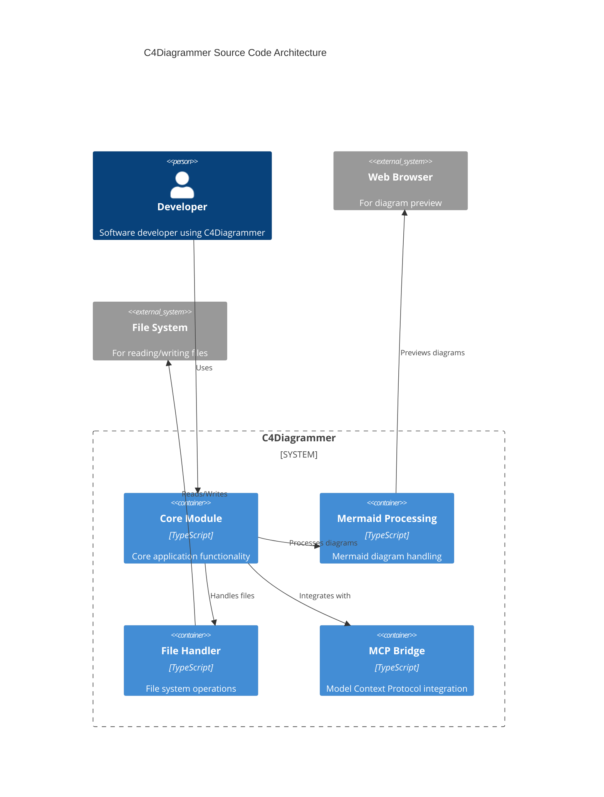

```mermaid
C4Component
    title C4Diagrammer Source Code Architecture

    Person(developer, "Developer", "Software developer using C4Diagrammer")
    
    System_Boundary(c4diagrammer, "C4Diagrammer") {
        Container(core, "Core Module", "TypeScript", "Core application functionality")
        Container(mermaid, "Mermaid Processing", "TypeScript", "Mermaid diagram handling")
        Container(file, "File Handler", "TypeScript", "File system operations")
        Container(mcp, "MCP Bridge", "TypeScript", "Model Context Protocol integration")
    }

    System_Ext(browser, "Web Browser", "For diagram preview")
    System_Ext(filesystem, "File System", "For reading/writing files")

    Rel(developer, core, "Uses")
    Rel(core, mcp, "Integrates with")
    Rel(core, mermaid, "Processes diagrams")
    Rel(core, file, "Handles files")
    Rel(mermaid, browser, "Previews diagrams")
    Rel(file, filesystem, "Reads/Writes")
``` 