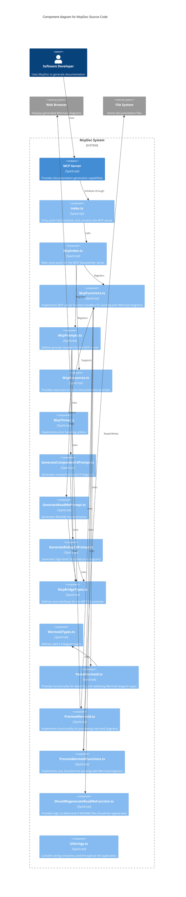

```mermaid
C4Component
    title Component diagram for McpDoc Source Code

    Person(user, "Software Developer", "Uses McpDoc to generate documentation")
    
    System_Boundary(mcp_doc, "McpDoc System") {
        Container(mcp_server, "MCP Server", "TypeScript", "Provides documentation generation capabilities")
        
        Component(index, "index.ts", "TypeScript", "Entry point that initializes and connects the MCP server")
        Component(mcp_index, "McpIndex.ts", "TypeScript", "Main entry point for the MCP Documenter server")
        Component(mcp_functions, "McpFunctions.ts", "TypeScript", "Implements MCP server function handlers for working with Mermaid diagrams")
        Component(mcp_prompts, "McpPrompts.ts", "TypeScript", "Defines prompt handlers for the MCP server")
        Component(mcp_resources, "McpResources.ts", "TypeScript", "Provides resources to return documentation prompts")
        Component(mcp_throw, "McpThrow.ts", "TypeScript", "Implements error handling utilities")
        
        Component(gen_component_c4, "GenerateComponentC4Prompt.ts", "TypeScript", "Generates component-level C4 diagrams")
        Component(gen_readme, "GenerateReadMePrompt.ts", "TypeScript", "Generates README documentation")
        Component(gen_rollup_c4, "GenerateRollupC4Prompt.ts", "TypeScript", "Generates high-level C4 architecture diagrams")
        
        Component(mcp_bridge_types, "McpBridgeTypes.ts", "TypeScript", "Defines core interfaces for the MCP Documenter")
        Component(mermaid_types, "MermaidTypes.ts", "TypeScript", "Defines valid C4 diagram types")
        
        Component(parse_mermaid, "ParseMermaid.ts", "TypeScript", "Provides functionality for detecting and validating Mermaid diagram types")
        Component(preview_mermaid, "PreviewMermaid.ts", "TypeScript", "Implements functionality for previewing mermaid diagrams")
        Component(process_mermaid, "ProcessMermaidFunctions.ts", "TypeScript", "Implements core functions for working with Mermaid diagrams")
        Component(should_regen, "ShouldRegenerateReadMeFunction.ts", "TypeScript", "Provides logic to determine if README files should be regenerated")
        Component(ui_strings, "UIStrings.ts", "TypeScript", "Contains string constants used throughout the application")
    }
    
    System_Ext(browser, "Web Browser", "Displays generated Mermaid diagrams")
    System_Ext(filesystem, "File System", "Stores documentation files")

    Rel(user, mcp_server, "Uses")
    Rel(mcp_server, index, "Initializes through")
    Rel(index, mcp_index, "Calls")
    Rel(mcp_index, mcp_functions, "Registers")
    Rel(mcp_index, mcp_prompts, "Registers")
    Rel(mcp_index, mcp_resources, "Registers")
    
    Rel(mcp_functions, parse_mermaid, "Uses")
    Rel(mcp_functions, preview_mermaid, "Uses")
    Rel(mcp_functions, process_mermaid, "Uses")
    Rel(mcp_functions, should_regen, "Uses")
    
    Rel(mcp_prompts, gen_component_c4, "Uses")
    Rel(mcp_prompts, gen_readme, "Uses")
    Rel(mcp_prompts, gen_rollup_c4, "Uses")
    
    Rel(gen_component_c4, mcp_bridge_types, "Uses")
    Rel(gen_readme, mcp_bridge_types, "Uses")
    Rel(gen_rollup_c4, mcp_bridge_types, "Uses")
    
    Rel(parse_mermaid, mermaid_types, "Uses")
    Rel(preview_mermaid, browser, "Opens")
    Rel(process_mermaid, filesystem, "Reads/Writes")
    Rel(mcp_throw, mcp_functions, "Supports")
```