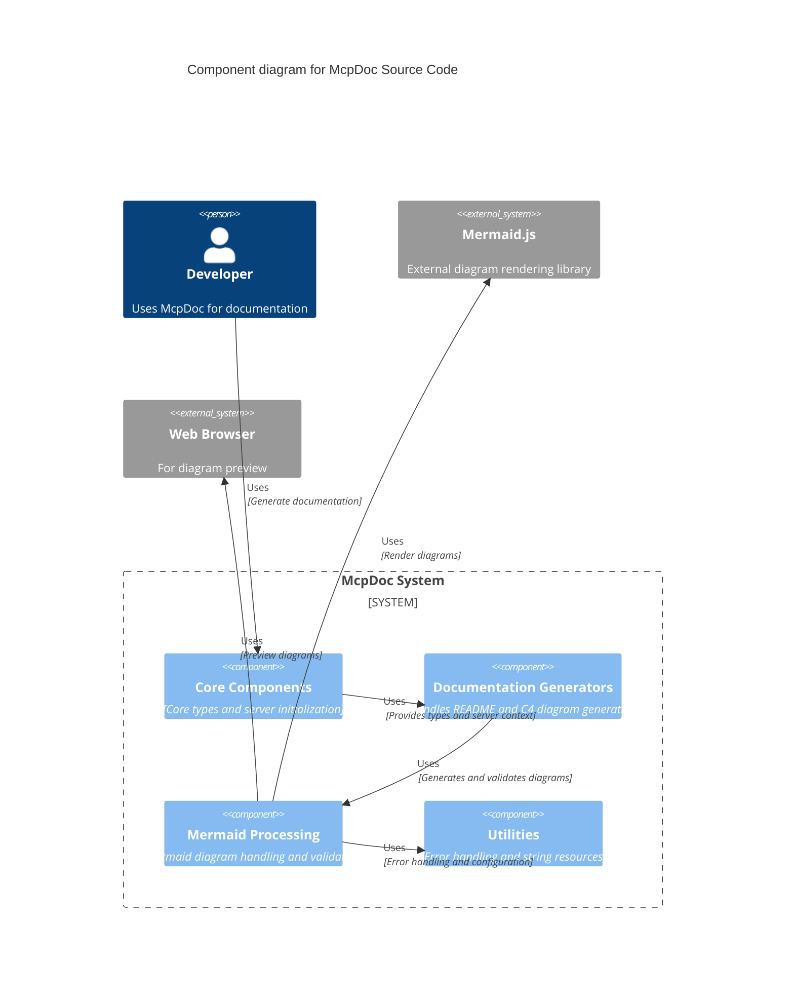

```mermaid
C4Component
    title Component diagram for McpDoc Source Code
    
    Person(developer, "Developer", "Uses McpDoc for documentation")
    
    System_Boundary(mcpdoc, "McpDoc System") {
        Component(core, "Core Components", "Core types and server initialization")
        Component(generators, "Documentation Generators", "Handles README and C4 diagram generation")
        Component(mermaid, "Mermaid Processing", "Mermaid diagram handling and validation")
        Component(utils, "Utilities", "Error handling and string resources")
        
        Rel(core, generators, "Uses", "Provides types and server context")
        Rel(generators, mermaid, "Uses", "Generates and validates diagrams")
        Rel(mermaid, utils, "Uses", "Error handling and configuration")
    }
    
    System_Ext(mermaidjs, "Mermaid.js", "External diagram rendering library")
    System_Ext(browser, "Web Browser", "For diagram preview")
    
    Rel(developer, core, "Uses", "Generate documentation")
    Rel(mermaid, mermaidjs, "Uses", "Render diagrams")
    Rel(mermaid, browser, "Uses", "Preview diagrams")
```