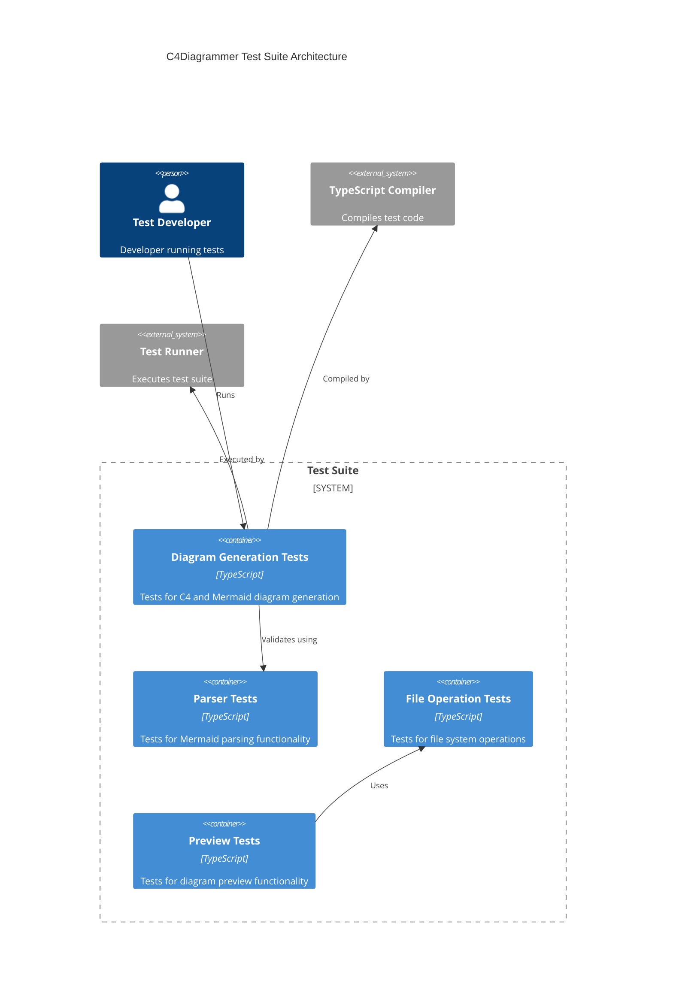

```mermaid
C4Component
    title C4Diagrammer Test Suite Architecture

    Person(tester, "Test Developer", "Developer running tests")
    
    System_Boundary(test_suite, "Test Suite") {
        Container(diagram_tests, "Diagram Generation Tests", "TypeScript", "Tests for C4 and Mermaid diagram generation")
        Container(parser_tests, "Parser Tests", "TypeScript", "Tests for Mermaid parsing functionality")
        Container(file_tests, "File Operation Tests", "TypeScript", "Tests for file system operations")
        Container(preview_tests, "Preview Tests", "TypeScript", "Tests for diagram preview functionality")
    }

    System_Ext(typescript, "TypeScript Compiler", "Compiles test code")
    System_Ext(test_runner, "Test Runner", "Executes test suite")

    Rel(tester, diagram_tests, "Runs")
    Rel(diagram_tests, typescript, "Compiled by")
    Rel(diagram_tests, test_runner, "Executed by")
    Rel(diagram_tests, parser_tests, "Validates using")
    Rel(preview_tests, file_tests, "Uses")
``` 