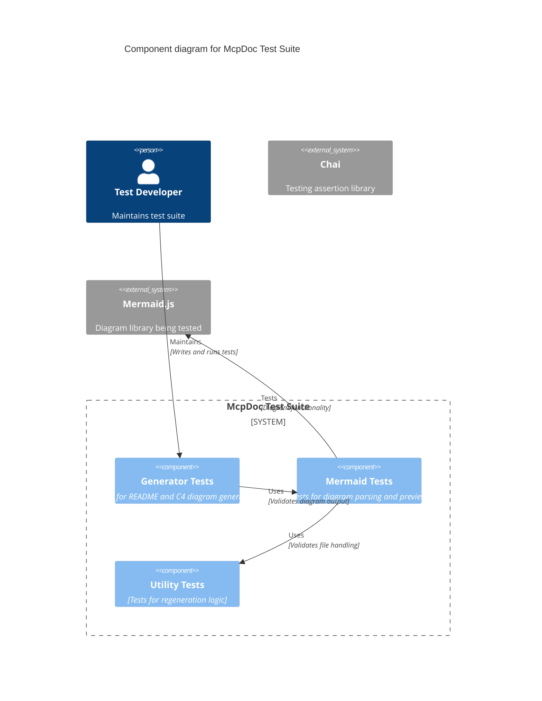

```mermaid
C4Component
    title Component diagram for McpDoc Test Suite
    
    Person(tester, "Test Developer", "Maintains test suite")
    
    System_Boundary(test_suite, "McpDoc Test Suite") {
        Component(generator_tests, "Generator Tests", "Tests for README and C4 diagram generation")
        Component(mermaid_tests, "Mermaid Tests", "Tests for diagram parsing and preview")
        Component(util_tests, "Utility Tests", "Tests for regeneration logic")
        
        Rel(generator_tests, mermaid_tests, "Uses", "Validates diagram output")
        Rel(mermaid_tests, util_tests, "Uses", "Validates file handling")
    }
    
    System_Ext(chai, "Chai", "Testing assertion library")
    System_Ext(mermaidjs, "Mermaid.js", "Diagram library being tested")
    
    Rel(tester, generator_tests, "Maintains", "Writes and runs tests")


    Rel(mermaid_tests, mermaidjs, "Tests", "Diagram functionality")
```