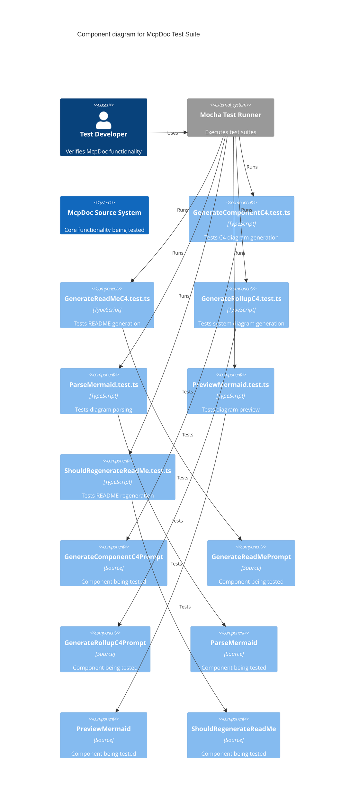

```mermaid
C4Component
    title Component diagram for McpDoc Test Suite
    
    Person(tester, "Test Developer", "Verifies McpDoc functionality")
    System_Ext(test_runner, "Mocha Test Runner", "Executes test suites")
    
    System(source_system, "McpDoc Source System", "Core functionality being tested")
    
    Component(gen_component_test, "GenerateComponentC4.test.ts", "TypeScript", "Tests C4 diagram generation")
    Component(gen_readme_test, "GenerateReadMeC4.test.ts", "TypeScript", "Tests README generation")
    Component(gen_rollup_test, "GenerateRollupC4.test.ts", "TypeScript", "Tests system diagram generation")
    Component(parse_mermaid_test, "ParseMermaid.test.ts", "TypeScript", "Tests diagram parsing")
    Component(preview_mermaid_test, "PreviewMermaid.test.ts", "TypeScript", "Tests diagram preview")
    Component(should_regen_test, "ShouldRegenerateReadMe.test.ts", "TypeScript", "Tests README regeneration")
    
    Component(gen_component, "GenerateComponentC4Prompt", "Source", "Component being tested")
    Component(gen_readme, "GenerateReadMePrompt", "Source", "Component being tested")
    Component(gen_rollup, "GenerateRollupC4Prompt", "Source", "Component being tested")
    Component(parse_mermaid, "ParseMermaid", "Source", "Component being tested")
    Component(preview_mermaid, "PreviewMermaid", "Source", "Component being tested")
    Component(should_regen, "ShouldRegenerateReadMe", "Source", "Component being tested")
    
    Rel(tester, test_runner, "Uses")
    Rel(test_runner, gen_component_test, "Runs")
    Rel(test_runner, gen_readme_test, "Runs")
    Rel(test_runner, gen_rollup_test, "Runs")
    Rel(test_runner, parse_mermaid_test, "Runs")
    Rel(test_runner, preview_mermaid_test, "Runs")
    Rel(test_runner, should_regen_test, "Runs")
    
    Rel(gen_component_test, gen_component, "Tests")
    Rel(gen_readme_test, gen_readme, "Tests")
    Rel(gen_rollup_test, gen_rollup, "Tests")
    Rel(parse_mermaid_test, parse_mermaid, "Tests")
    Rel(preview_mermaid_test, preview_mermaid, "Tests")
    Rel(should_regen_test, should_regen, "Tests")
```